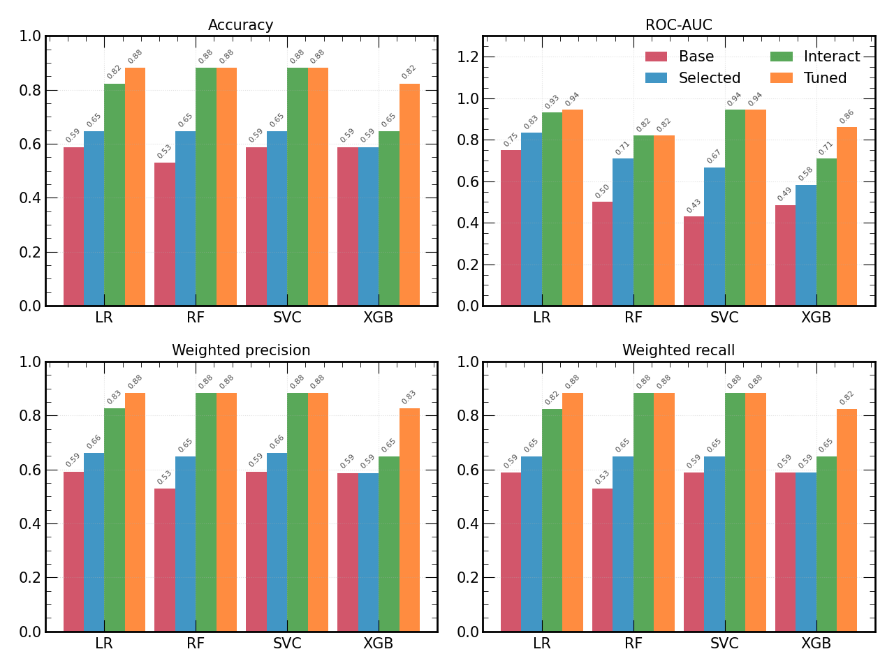
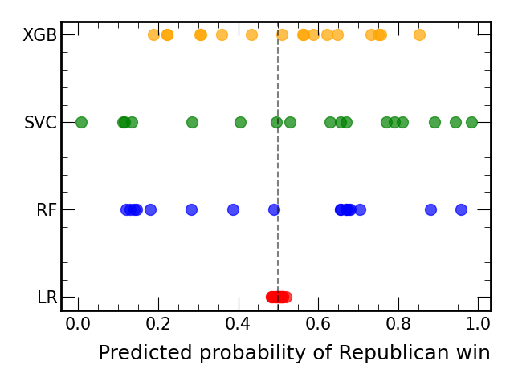
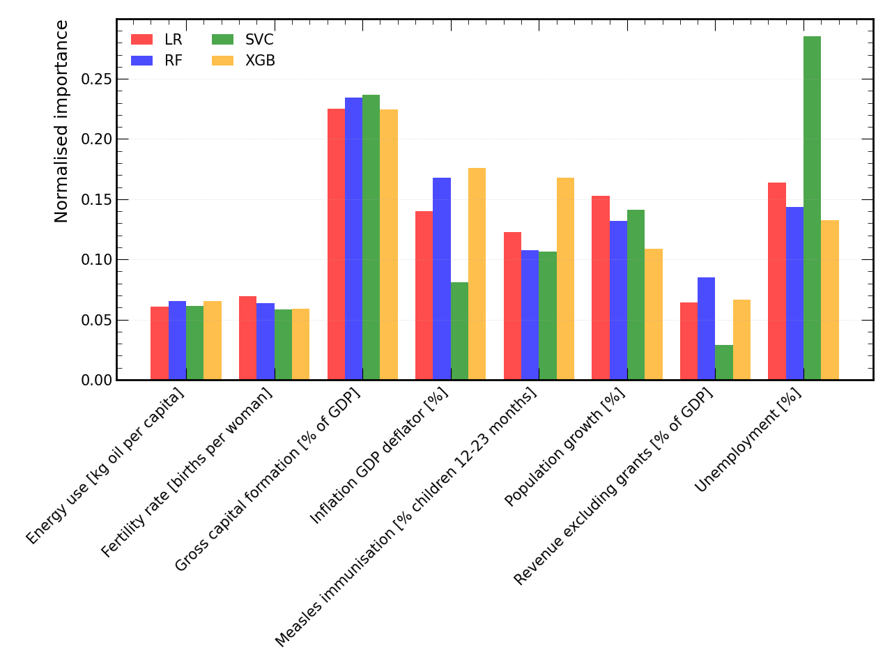
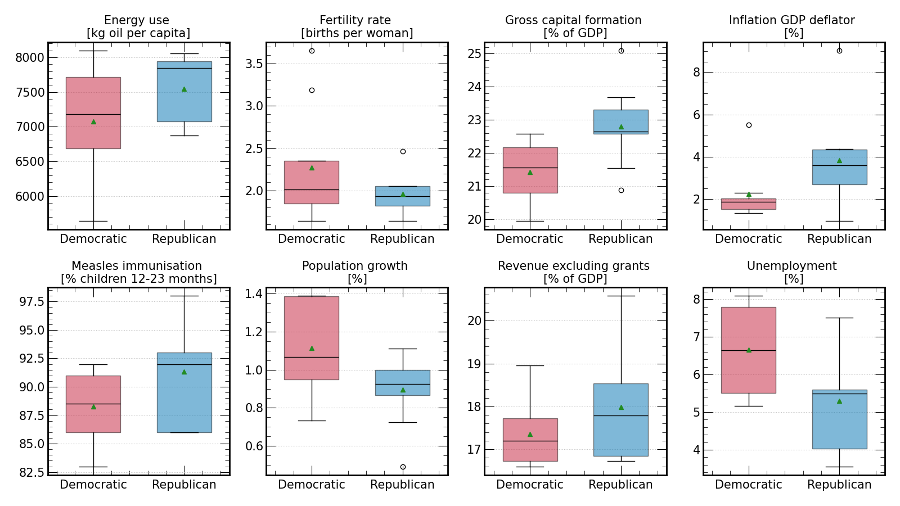

# Predicting US presidential elections (1960-2024)

*Can macro socioeconomic indicators predict US presidential election outcomes?*

This study applies four machine learning algorithms (Logistic Regression, Random Forest, Support Vector Classifier, and XGBoost) to predict US presidential election outcomes (1960–2024), using macro socioeconomic indicators. After systematic feature engineering and hyperparameter optimisation, three independent model architectures converged on identical **88.2% accuracy (15/17 elections)**, suggesting this represents the performance ceiling achievable with this approach. Gross capital formation, unemployment, and inflation emerge as dominant predictors, with two consistent misclassifications (2016 Trump, 1976 Carter) reflect uniquely political circumstances that can override economic signals.

## Technical details

The workflow from raw data to a set of optimised models is contained in `main.ipynb`. Reptitive tasks are handled by three internal modules: 

1. `process_data.py`: Processes, cleans, and merges raw data into data/proc/data.csv 
1. `train.py`: Contains a configurable class Train which runs the training and outputs standard results (the model, test predictions, truth values, and probabilities) 
1. `analyse.py`: Performs standard analysis on the results, returning statistics such as the confusion matrix, ROC-AUC, and accuracy

The structure of the project is given below:
```
├── code
│   ├── analyse.py # Model performance analysis
│   ├── main.ipynb # Main project notebook 
│   ├── plot.mplstyle # Plot styling
│   ├── process_data.py # Data processing module
│   └── train.py # Model training
├── data
│   ├── proc # Processed data (generated)
│   └── raw # Raw data
│       ├── election_data.csv
│       ├── FRED_unemployment_rate_1948-2024.csv
│       └── world_bank_indicators_1960-2023.csv
├── images # Images (generated)
├── models # Models (generated)
├── README.md
├── results # Analysis results (generated)
```

**Libraries:** pandas, numpy, matplotlib, scikit-learn, XGBoost

## Analysis report

### Overview

This analysis explores whether macro socioeconomic indicators can predict US presidential election outcomes. Four machine learning classification models were systematically optimised to predict whether the winning candidate would be a Democrat or Republican, based on annual economic and social data during election years.

### Data

**Sources:**
- [Election outcomes](https://www.presidency.ucsb.edu/statistics/elections) including winner and party (1960–2024)
- [World Bank](https://databank.worldbank.org/indicator/NY.GDP.MKTP.KD.ZG/1ff4a498/Popular-Indicators) macroeconomic indicators: GDP growth, inflation, foreign investment, etc.
- [Federal Reserve Bank](https://fred.stlouisfed.org/series/UNRATE) unemployment rates, with monthly data aggregated to yearly averages

**Preprocessing:**
- Columns with >50% missing values were dropped
- Linear interpolation filled remaining gaps
- Final dataset: **35 features, 17 samples** (elections from 1960–2020)

The small sample size (n=17) presents a fundamental challenge for model generalisation and necessitates careful validation strategies, including Leave-One-Out Cross Validation (LOOCV).

### Methodology

The analysis followed a systematic optimisation process, evaluating four model variants for each algorithm:

1. **Base**: All 35 features with LOOCV
2. **Selected**: 10 features identified by SelectKBest (ANOVA F-statistic)
3. **Interact**: 15 features including interaction terms (products of features)
4. **Tuned**: Hyperparameter optimisation via grid search with LOOCV

#### 1. Initial model comparison (base)

Four classification algorithms were evaluated using Leave-One-Out Cross-Validation (LOOCV):

| Model | Accuracy | ROC-AUC | Precision | Recall |
|-------|----------|---------|-----------|--------|
| Logistic Regression (LR) | 0.647 | 0.833 | 0.661 | 0.647 |
| Random Forest (RF) | 0.706 | 0.771 | 0.735 | 0.706 |
| Support Vector Classifier (SVC) | 0.647 | 0.778 | 0.677 | 0.647 |
| XGBoost (XGB) | 0.588 | 0.625 | 0.579 | 0.588 |

Random Forest demonstrates the highest baseline accuracy (70.6%), whereas Logistic Regression achieved superior class separation (ROC-AUC 0.833).

#### 2. Feature engineering

**Feature selection:**

SelectKBest with ANOVA F-statistic identified the 10 most predictive features from the initial 35. These 10 features improved performance across all models.

**Interaction terms:**
Products of features (degree=2, interaction_only=True) were trialed, producing 55 generated features from the 10 base features. `SelectKBest` then reduced these to 15 most predictive terms, capturing multiplicative relationships between indicators. The final models use **eight unique base features** (four standalone and seven appearing in interaction terms):

1. Energy use (kg of oil equivalent per capita)
2. Fertility rate, total (births per woman)
3. Gross capital formation (% of GDP)
4. Inflation, GDP deflator (annual %)
5. Immunization, measles (% of children ages 12-23 months)
6. Population growth (annual %)
7. Revenue, excluding grants (% of GDP)
8. Unemployment (%)

Key interaction terms include:
- Population growth × Fertility rate
- Inflation GDP deflator × Gross capital formation
- Measles immunisation × Energy use
- Population growth × Unemployment

#### 3. Hyperparameter optimisation

A comprehensive grid search with LOOCV was then conducted on the four algorithms:

**Logistic Regression** (408 combinations):
- Best parameters: C=0.001, penalty='l2', solver='liblinear'
- Best CV accuracy: **0.882**

**Random Forest** (216 combinations):
- Best parameters: n_estimators=100, max_depth=3, max_features='sqrt'
- Best CV accuracy: **0.882**

**Support Vector Classifier** (3,060 combinations):
- Best parameters: C=1, kernel='linear', gamma='scale'
- Best CV accuracy: **0.882**

**XGBoost** (22,032 combinations):
- Best parameters: n_estimators=100, max_depth=3, learning_rate=0.05, subsample=0.6
- Best CV accuracy: **0.765**



### Model convergence

**Three independent algorithms (LR, RF, SVC) converged on identical 88.2% accuracy** after optimisation. This convergence across fundamentally different model architectures -- linear (LR), kernel-based (SVC), and tree-based (RF) -- strongly suggests **88.2% represents the performance ceiling achievable with macro socioeconomic indicators alone**.

## Classifications

The table below shows model predictions with probability of Republican victory in brackets. Probabilities >0.5 predict Republican; <0.5 predict Democratic.

| Year | Winner            | Party       | LR         | RF         | SVC        | XGB        |
|------|-------------------|-------------|------------|------------|------------|------------|
| 2024 | Donald Trump      | Republican  | ✅ (0.510) | ✅ (0.675) | ✅ (0.982) | ✅ (0.656) |
| 2020 | Joseph Biden      | Democratic  | ✅ (0.493) | ✅ (0.180) | ✅ (0.117) | ✅ (0.291) |
| 2016 | Donald Trump      | Republican  | ❌ (0.498) | ❌ (0.140) | ✅ (0.494) | ❌ (0.276) |
| 2012 | Barack Obama      | Democratic  | ✅ (0.493) | ✅ (0.282) | ✅ (0.111) | ✅ (0.367) |
| 2008 | Barack Obama      | Democratic  | ✅ (0.498) | ✅ (0.387) | ✅ (0.405) | ✅ (0.492) |
| 2004 | George W. Bush    | Republican  | ✅ (0.504) | ✅ (0.705) | ✅ (0.655) | ✅ (0.792) |
| 2000 | George W. Bush    | Republican  | ✅ (0.510) | ✅ (0.660) | ✅ (0.891) | ✅ (0.557) |
| 1996 | William Clinton   | Democratic  | ✅ (0.499) | ✅ (0.489) | ✅ (0.529) | ❌ (0.592) |
| 1992 | William Clinton   | Democratic  | ✅ (0.484) | ✅ (0.146) | ✅ (0.007) | ✅ (0.333) |
| 1988 | George Bush       | Republican  | ✅ (0.509) | ✅ (0.957) | ✅ (0.790) | ✅ (0.837) |
| 1984 | Ronald Reagan     | Republican  | ✅ (0.511) | ✅ (0.655) | ✅ (0.771) | ❌ (0.469) |
| 1980 | Ronald Reagan     | Republican  | ✅ (0.519) | ✅ (0.655) | ✅ (0.811) | ✅ (0.538) |
| 1976 | Jimmy Carter      | Democratic  | ❌ (0.504) | ❌ (0.880) | ❌ (0.669) | ❌ (0.700) |
| 1972 | Richard Nixon     | Republican  | ✅ (0.503) | ✅ (0.680) | ❌ (0.629) | ✅ (0.543) |
| 1968 | Richard Nixon     | Republican  | ✅ (0.505) | ✅ (0.670) | ✅ (0.943) | ✅ (0.674) |
| 1964 | Lyndon B. Johnson | Democratic  | ✅ (0.488) | ✅ (0.130) | ✅ (0.284) | ✅ (0.257) |
| 1960 | John F. Kennedy   | Democratic  | ✅ (0.483) | ✅ (0.120) | ✅ (0.133) | ✅ (0.253) |

#### Observations

**1. Model confidence varies dramatically**

Logistic Regression exhibits remarkably low confidence across all predictions, with probabilities clustering tightly around 0.5 (range: 0.483–0.519). The model achieves 88.2% accuracy whilst expressing near-complete uncertainty about individual predictions. In contrast, Random Forest and SVC demonstrate strong confidence for most elections, with probabilities often exceeding 0.65 or falling below 0.35.




**2. The 2016 anomaly**

Trump 2016 represents a challenging prediction:

- **LR**: 0.498 probability Republican
- **RF**: 0.140 probability Republican
- **SVC**: 0.494 probability Republican
- **XGBoost**: 0.276 probability Republican

SVC succeeded where others failed, but just barely. This suggests 2016's outcome was nearly orthogonal to macro socioeconomic indicators.

**3. The 1976 anomaly**

Carter 1976 is another difficult prediction: 

- **LR**: 0.504 probability Republican 
- **RF**: 0.880 probability Republican 
- **SVC**: 0.669 probability Republican 
- **XGBoost**: 0.700 probability Republican

All models predicted a Rebublican victory with high relative confidence, which suggest that this election was driven by uniquely political circumstances during the post-Watergate upheaval. 

**3. Consensus predictions**

Elections with near-unanimous model agreement and high confidence:
- **1988 Bush (R)**: RF=0.957, SVC=0.790, XGB=0.837 — strong Republican economic signals
- **1992 Clinton (D)**: RF=0.146, SVC=0.007 — overwhelming Democratic indicators
- **2024 Trump (R)**: SVC=0.982 — exceptionally strong Republican signal
- **1960 Kennedy (D)**: RF=0.120, SVC=0.133 — clear Democratic economic conditions

**4. XGBoost underperformance**

Whilst LR, RF, and SVC each made 2–3 errors, XGBoost misclassified 4 elections (2016 Trump, 1996 Clinton, 1984 Reagan, 1976 Carter). The model's more complex architecture appears to overfit the limited training data despite regularisation.

**5. Ambiguous signals (near-50% probabilities)**

- **1996 Clinton**: LR=0.499, RF=0.489, SVC=0.529, XGB=0.592 (Clinton's re-election during political scandal)
- **2008 Obama**: LR=0.498, RF=0.387, SVC=0.405, XGB=0.492 (Obama's first election, following the 2008 financial crisis)

These near-equiprobable predictions across models suggest the macro socioeconomic indicators provided genuinely ambiguous signals.

### Feature importance analysis

Feature importance was aggregated across all four optimised models. For interaction terms, importance was split equally between the two base features involved. The comparison reveals consistent patterns across different model architectures:



| Feature                                         | LR       | RF       | SVC      | XGB      |
|-------------------------------------------------|----------|----------|----------|----------|
| Energy use [kg oil per capita]                  | 0.060795 | 0.065594 | 0.061296 | 0.065413 |
| Fertility rate [births per woman]               | 0.069496 | 0.063800 | 0.058606 | 0.058809 |
| Gross capital formation [% of GDP]              | 0.225281 | 0.234555 | 0.236828 | 0.224805 |
| Inflation GDP deflator [%]                      | 0.140208 | 0.167735 | 0.081208 | 0.175989 |
| Measles immunisation [% children 12-23 months]  | 0.122953 | 0.107791 | 0.106715 | 0.167578 |
| Population growth [%]                           | 0.152977 | 0.132104 | 0.140949 | 0.108729 |
| Revenue excluding grants [% of GDP]             | 0.064235 | 0.085106 | 0.028848 | 0.066266 |
| Unemployment [%]                                | 0.164055 | 0.143314 | 0.285551 | 0.132412 |

**Observations:**

1. **Gross capital formation** emerges as a dominant predictor across all models, particularly for Random Forest (normalised importance ~0.24). Investment in fixed assets and economic confidence strongly correlate with electoral outcomes.

2. **Unemployment** shows the second-highest importance (0.14-0.16 across models), with consistent rankings suggesting its robust predictive power.

3. **Inflation GDP deflator** ranks highly in tree-based models (RF, XGB) but shows more modest importance in linear models (LR, SVC).

4. **Population growth** and **fertility rate** contribute moderately across all models, capturing demographic trends.

5. Model agreement on feature rankings strengthens confidence that these economic indicators genuinely drive electoral outcomes rather than being artifacts of individual model architectures.

### Economic conditions and electoral outcomes

Box plots comparing the eight base features used in the final models between Democratic and Republican victories reveal systematic patterns:



### Strong differences (>10% difference):

**Economic indicators:**
- **Inflation GDP deflator**: Republicans show **72% higher inflation** (3.82% vs 2.22% mean), which is the largest relative difference
- **Unemployment**: Democrats show **25% higher unemployment** (6.66% vs 5.30% mean)

**Demographic Indicators:**
- **Fertility rate**: Democrats show **16% higher fertility** (2.27 vs 1.96 mean)
- **Population growth**: Democrats show **25% higher growth** (1.12% vs 0.90% mean)

### Moderate differences (5-10% difference):

- **Energy use**: Republicans 7% higher (7548 vs 7079 kg oil per capita)
- **Gross capital formation**: Republicans 6% higher (22.8% vs 21.4% of GDP)

### Minimal differences (<5% difference):

- **Revenue excluding grants**: Republicans 4% higher (18.0% vs 17.4%)
- **Measles immunisation**: Republicans 3% higher (91.3% vs 88.3%) 

Republican outcomes strongly associate with **lower unemployment** and **higher inflation**. Democratic outcomes associate with **higher population growth** and **higher fertility**.

### Conclusions

1. **Macro socioeconomic indicators are strong but imperfect predictors** of US presidential election outcomes, achieving 88.2% accuracy over 17 elections spanning 64 years.

2. **Model convergence signals a performance ceiling.** Three independent algorithms with different architectures all converged on 88.2% accuracy, suggesting this represents the maximum achievable performance from macro socioeconomic data alone. Further improvement requires non-economic features to capture the remainder of the variance.

3. **Sample size is a limitation.** With only 17 observations, models are constrained by limited training data despite using LOOCV and shallow architectures to prevent overfitting.

4. **Feature engineering improved performance substantially.** Interaction terms captured complex relationships between economic variables, whilst feature selection reduced noise. Baseline performance of 58–71% improved to 88.2% through systematic optimisation.

5. **Exceptional political circumstances override economic signals.** Both misclassifications (2016 Trump, 1976 Carter) involved unique political contexts — populist movements and post-Watergate upheaval — that macro socioeconomic indicators cannot capture.

6. **Investment and inflation dominate predictions.** Gross capital formation (~24% normalised importance across models), inflations, and unemployment drive model decisions, suggesting economic stability and business confidence strongly influence electoral preferences. The consistency of these rankings across all four model types (LR, RF, SVC, XGB) validates this. 

## Assumptions and limitations

Elections are not independent; political momentum and demographic shifts create dependencies not addressed by LOOCV. Cultural factors, foreign policy, candidate quality, campaign effectiveness, and media dynamics are not captured. 

## Potential improvements

- Incorporate polling data, demographic trends, or sentiment analysis from news/social media
- Expand to state-level predictions (50 states × 17 elections = 850 samples)
- Implement time-series aware validation strategies
- Ensemble economic and non-economic features with regularisation


## Analysis report 

A detailed report analysis report is given 


## Key findings

### Top economic predictors
1. **Unemployment rate** - Most important predictor (importance: 0.977)
2. **Inflation rate** - Second most important (importance: 0.797)

### Weak economic predictors 
Factors such as **net migration**, **total population**, and **GDP** were found to be weakly or not correlated with election outcomes. 

### Historical patterns
- **High unemployment (>7%)** → Favors Democrats
  - Examples: 2020 Biden (8.1%), 1992 Clinton (7.5%), 1976 Carter (7.7%)
  
- **High inflation (>10%)** → Favors Republicans  
  - Example: 1980 Reagan landslide (13.5% inflation)

### Average economic conditions by winner
| Party | Avg unemployment | Avg inflation |
|-------|------------------|---------------|
| **Democratic** | 6.7% | 2.8% |
| **Republican** | 5.4% | 5.9% |

---

## Methodology

**Data sources:**
- Election results: 1960-2024 presidential elections
- Economic data: FRED (unemployment), World Bank (inflation, GDP, population)

**Machine learning:**
- Models: Logistic Regression, Random Forest, SVM
- Validation: Leave-One-Out Cross-Validation (LOOCV)
- Feature selection: Correlation threshold >30%

**Results:**
| Model | Accuracy |
|-------|----------|
| Logistic Regression | **58.8%** |
| Random Forest | 58.8% |
| SVM (Linear) | 47.1% |

---

## Limitations

- **Small sample**: 17 elections limits statistical power
- **Missing variables**: Candidate charisma, campaign strategy, social issues, foreign policy
- **Correlation ≠ causation**: These are associations, not causal relationships
- **Limited improvement**: 58.8% vs 50% baseline suggests ~40% of variance remains unexplained

---

## Technical details

See `ana/ana.ipynb` for full analysis including:
- Data preprocessing and cleaning
- Feature correlation analysis  
- Model training and evaluation
- Visualisations

**Libraries:** pandas, numpy, scikit-learn, matplotlib